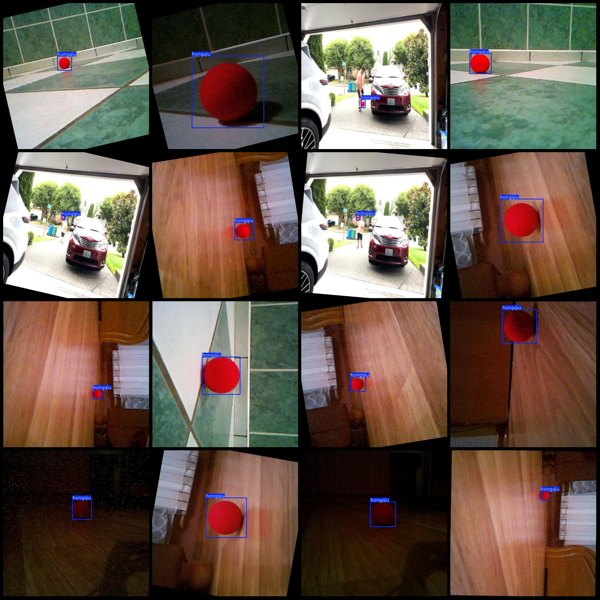
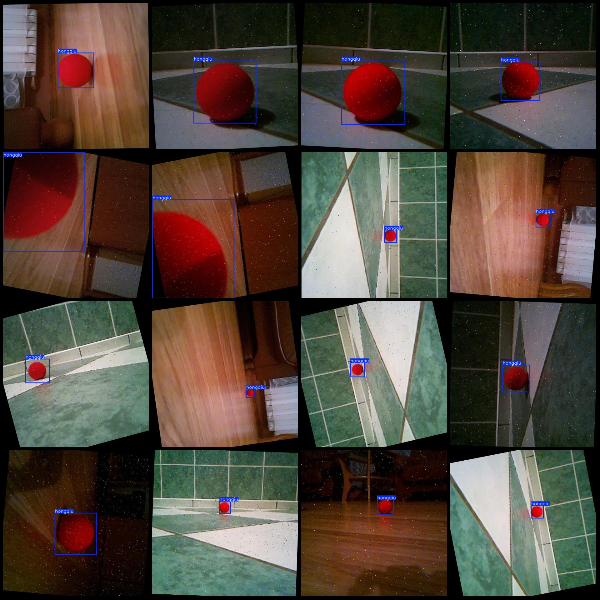

# VOC+YOLO dataset with 1342 images and 1 category with enhanced features

Please note that there are many augmentations in the dataset, and the original image size is only 153. After rotation and noise augmentation, it has been expanded significantly. Those who are sensitive to augmented images should carefully review the images.
Dataset format: Pascal VOC format + YOLO format (without split path in txtfile, only contains jpgimage and corresponding VOC format xmlfile and yolo format txtfile)
Number of image files (jpg): 1342
annotation count: 1342  
1342
1.
Category Name: ["hongqiu"]
boxes per class:   
hongqiu box count = 1342  
Total frames: 1342
Number of images per category:
hongqiu images = 1342  
image resolution: 640x640  
Use annotation tool: labelImg.
Annotation rule: draw a rectangle around the class.
Important Note: The dataset does not have a split into training, validation, and test sets.
Special Statement: This dataset does not guarantee the accuracy of the trained model or weight file.
Preview of the image:
## Images

Here is a pay link on Stripe ( https://buy.stripe.com/3cs8yP7sY87d0vu9AB ). Please contact me lonlonago@foxmail.com after funding $89, and I will send you a complete data files , thank you!

